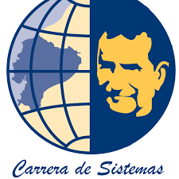
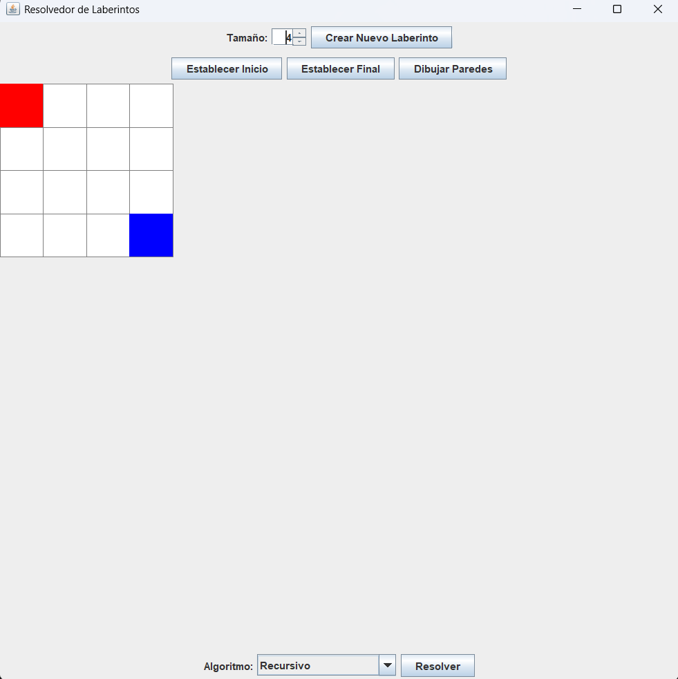
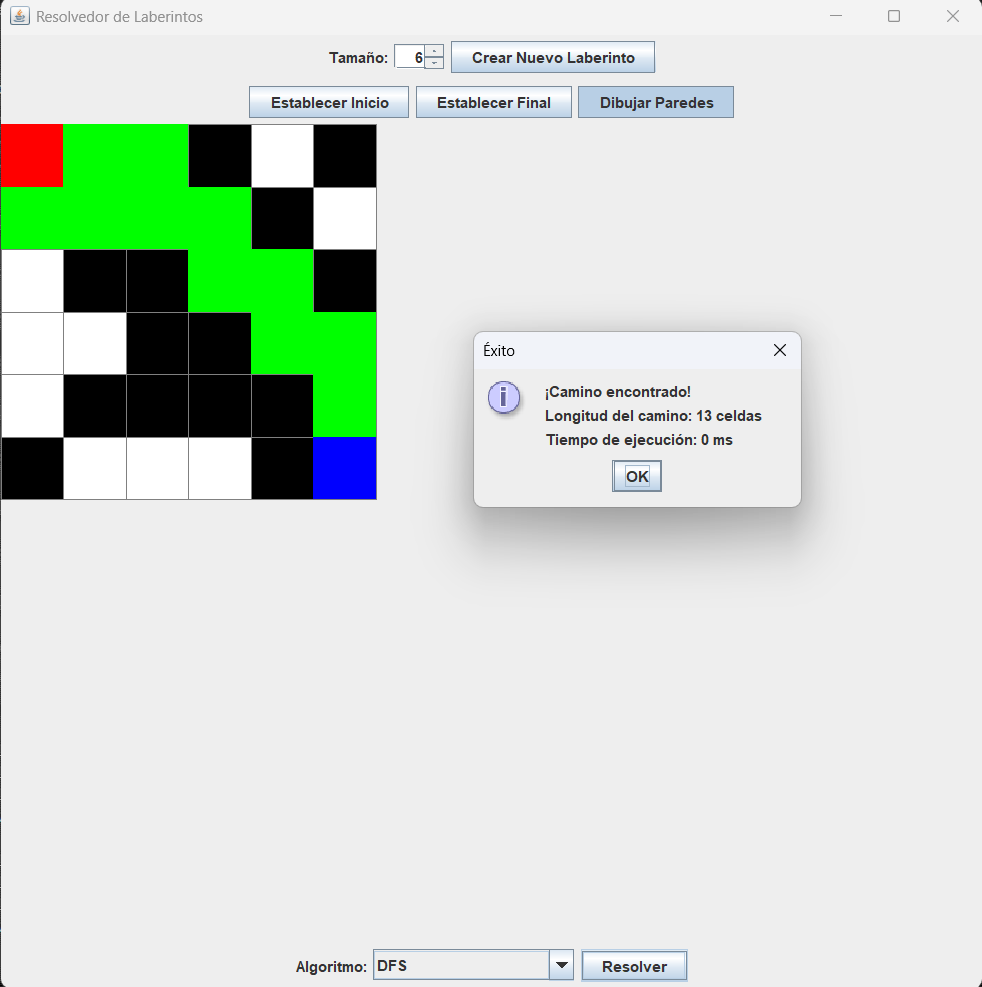
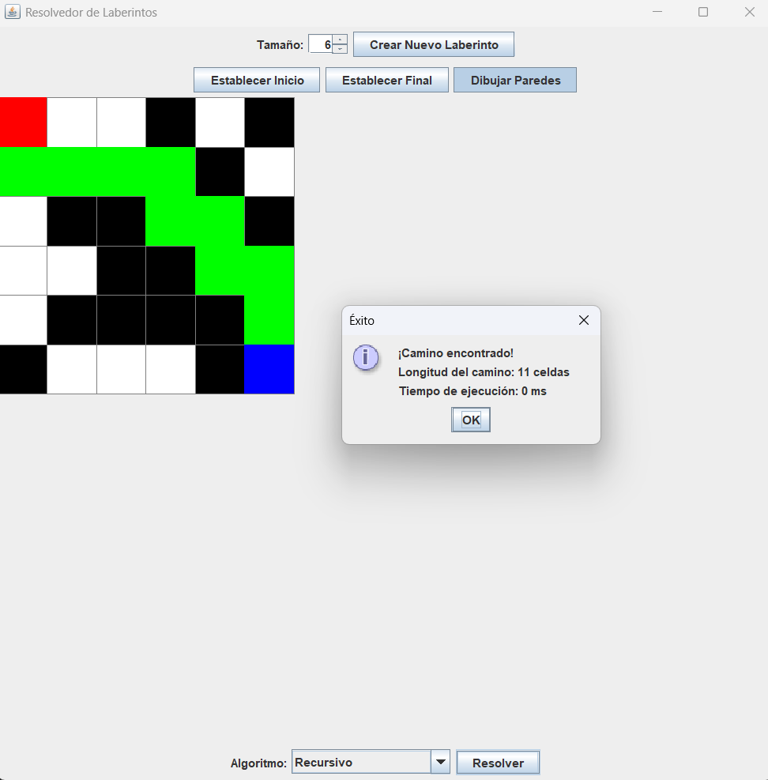
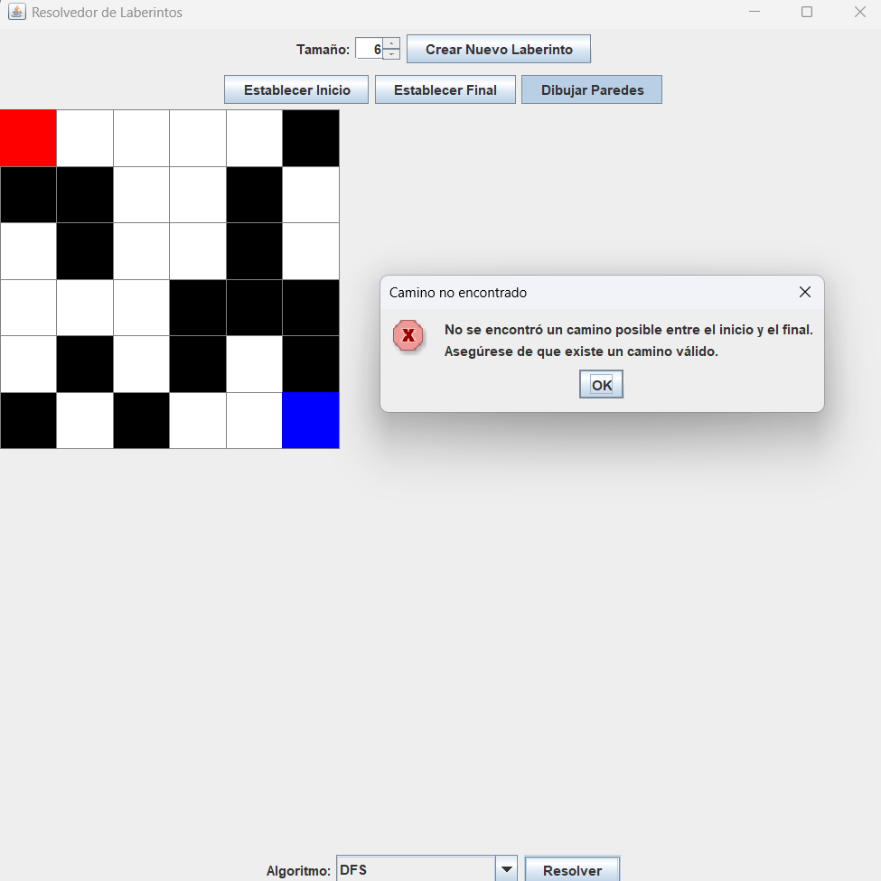
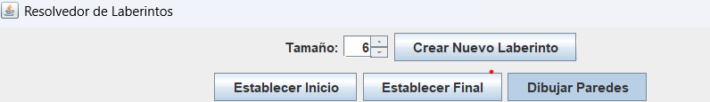
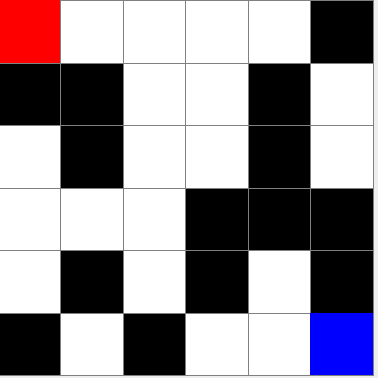

                                                         
# Laberinto: Resolución y Algoritmos de Búsqueda

**Materia**: Algoritmos y Estructuras de Datos  
**Carrera**: Ingeniería en Sistemas Computacionales  
**Universidad**: Universidad Politécnica Salesiana  
**Integrantes**:
- **Alexander Tigre** - jtigreq@est.ups.edu.ec  

---

## Descripción del problema

El proyecto tiene como objetivo resolver el problema clásico del laberinto utilizando varios algoritmos de búsqueda: Recursión, Programación Dinámica, Búsqueda en Anchura (BFS) y Búsqueda en Profundidad (DFS). El laberinto estará compuesto por celdas transitables y no transitables, y el usuario podrá interactuar con la interfaz gráfica para configurar el tamaño del laberinto, establecer el punto de inicio y el punto final, así como configurar las celdas transitables y no transitables.

La problemática consiste en encontrar el camino más corto entre un punto de inicio y un punto final en un laberinto, utilizando los algoritmos mencionados para garantizar soluciones eficientes.

---

## Propuesta de solución

### Marco Teórico

- **Programación Dinámica**: Es una técnica de optimización que resuelve problemas dividiéndolos en subproblemas más pequeños y solucionándolos de manera recursiva, almacenando los resultados para evitar el cálculo repetido. En el contexto de los laberintos, la programación dinámica se puede utilizar para calcular los caminos más cortos utilizando una tabla que almacene las soluciones intermedias a medida que se exploran las celdas del laberinto.

- **BFS (Búsqueda en Anchura)**: El algoritmo de Búsqueda en Anchura es ideal para encontrar el camino más corto en un grafo o laberinto sin obstáculos. BFS comienza en el nodo inicial y explora todos los nodos vecinos antes de avanzar a los nodos más distantes. Esto garantiza que el primer camino encontrado al objetivo será el más corto, ya que explora todas las opciones de nivel más bajo primero.

- **DFS (Búsqueda en Profundidad)**: A diferencia de BFS, el algoritmo de Búsqueda en Profundidad explora cada rama del grafo o laberinto completamente antes de retroceder y explorar otras ramas. DFS no garantiza que encuentre el camino más corto, pero puede ser útil en laberintos con pocas opciones o cuando se busca explorar todas las posibles soluciones, aunque con una menor eficiencia en comparación con BFS.

### Descripción de la propuesta de solución

La propuesta de solución consiste en implementar un sistema para la resolución de laberintos utilizando los algoritmos mencionados anteriormente. El sistema está basado en **Java** y usa **Swing** para crear la interfaz gráfica. El diseño sigue el patrón de arquitectura **MVC (Modelo-Vista-Controlador)**, lo que permite una separación clara entre la lógica del negocio y la interfaz de usuario.

#### Funcionalidades clave del sistema:

1. **Interfaz Gráfica**: La interfaz permite al usuario interactuar con el laberinto, configurar su tamaño, definir celdas transitables o no transitables, y elegir el punto de inicio y fin. Además, ofrece la posibilidad de seleccionar el algoritmo de búsqueda que se desea utilizar (Recursivo, Programación Dinámica, BFS, DFS).

2. **Generación Dinámica de Laberintos**: El sistema genera laberintos con diferentes tamaños y configuraciones de obstáculos. El usuario puede seleccionar el tamaño deseado desde la interfaz, lo que permite una flexibilidad total en las pruebas de diferentes configuraciones.

3. **Implementación de Algoritmos**: Cuatro algoritmos de búsqueda se implementan para encontrar el camino más corto en el laberinto:
   - **Recursivo**: A través de una solución recursiva básica, buscando posibles caminos.
   - **Programación Dinámica**: Implementando el principio de optimización de subproblemas.
   - **BFS**: Usando cola para explorar los nodos más cercanos primero y encontrar el camino más corto.
   - **DFS**: Explorando profundamente antes de retroceder y sin garantizar el camino más corto.

**Herramientas y Lenguajes Utilizados**:
- **Lenguaje de Programación**: Java
- **Biblioteca Gráfica**: Swing para la interfaz de usuario.
- **Patrón de Diseño**: MVC
- **IDE**: Visual Studio Code

**Criterio de propuesta por integrante**:
- **Alexander**: Implementación de la interfaz gráfica con **Swing**, integración de los algoritmos BFS y DFS, y gestión del tamaño del laberinto.

### Capturas de la implementación final de la UI

-Muestra la interfaz gráfica cuando se abre la aplicación.

-Una captura por cada algoritmo en acción (DFS, BFS, recursivo, programación dinámica).

*MazeSolverDFS

*MazeSolverBfs

*MazeSolverRecursivo

*MazeSolverDP

*No encontró un camino.

**Imagen de la interfaz gráfica de configuración**  

-Imagen donde el usuario puede elegir el tamaño del laberinto y configurar obstáculos.

-Muestra cómo el usuario puede seleccionar el punto de partida y la meta.

---

## Conclusiones

En cuanto a la elección del mejor algoritmo para encontrar el camino más corto en un laberinto, se concluye que **BFS** es el más adecuado para este tipo de problemas. Esto se debe a que BFS garantiza encontrar el camino más corto de manera eficiente, explorando primero los nodos vecinos antes de adentrarse en nodos más lejanos. A diferencia de DFS, que no garantiza encontrar el camino más corto, y la Recursión, que puede ser ineficiente en laberintos grandes.

---

## Consideraciones

Este proyecto puede extenderse y mejorarse de varias formas. Algunas consideraciones adicionales incluyen:
- La implementación de un algoritmo de **A\* (A Star)**, que es más eficiente que BFS para laberintos con obstáculos complejos.
- Optimizar la interfaz gráfica para permitir una mayor personalización del laberinto.
- Aplicaciones en juegos, robótica, y en cualquier sistema que necesite resolver problemas de navegación en espacios complejos.

---

## Características del Proyecto

- Permite la configuración dinámica del tamaño del laberinto y la selección de celdas transitables y no transitables.
- El usuario puede seleccionar el punto de partida y el punto final desde la interfaz.
- Implementación de los algoritmos Recursivos, Programación Dinámica, BFS, y DFS para la resolución del laberinto.

---

## Licencia

Este proyecto está bajo la Licencia MIT.

---

**[Maze Solver]**  
Desarrollado por **Alexander Tigre**   
Universidad Politécnica Salesiana, sede Cuenca, Ecuador.

